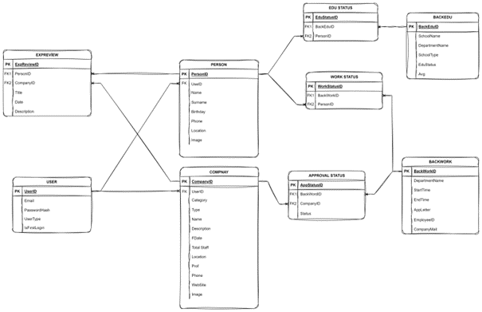
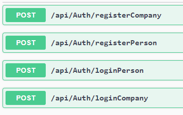
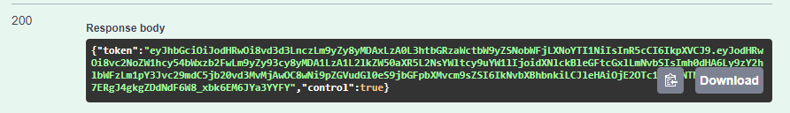

# Internship's Backend
The company where I completed my internship requested us to redesign a miniature version of their in-house website, vizyonergenc.com, along with a creative feature addition. Using .NET, I developed a backend that includes not only basic functionalities but also additional features.

# Database Design
I began by roughly designing a database, with the intention of adding the necessary connections and tables later.

# Endpoints
My favorite endpoints were the login and signup endpoints.
I ensured communication with the frontend using tokens due to the presence of different user types. I leveraged the 'Role' model class for this purpose.

